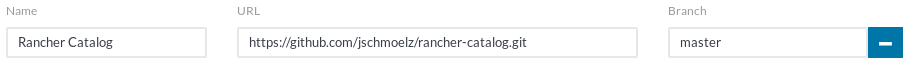

# Rancher Catalog

This Rancher catalog contains some application templates for Rancher 1.6 that I use in my projects.

If you have any feedback, please feel free to get in touch with me.
Pull requests are very welcome.

I will maintain this repository until Rancher 1.6 reaches its [EOL](https://rancher.com/support-maintenance-terms/) on
__June 30, 2020__.

## How to use

You can either add this catalog to Rancher globally, so that it is available for all users in all environments, or you
can only add it to selected environments.

If you want to use it globally, you have to add it via _Admin → Settings → Add Catalog_. You must be admin to do so.



If you only want to permit access to the catalog in certain environments, you have to switch to the specific environment
and add it via _Catalog → Manage → Add Catalog_. This is also possible for normal users.

## How to add a new catalog entry

There is an [open source project](https://github.com/slashgear/generator-rancher-catalog) based on Yeoman which you can
use to create new catalog entries. For further information and install instructions, please visit the project's Github
page. 

The basic steps to create a new catalog entry are outlined below.

```bash
$ git clone https://github.com/jschmoelz/rancher-catalog.git
$ cd rancher-catalog
$ yo rancher-catalog

     _-----_     ╭──────────────────────────╮
    |       |    │    Welcome to the good   │
    |--(o)--|    │ generator-rancher-catalo │
   `---------´   │       g generator!       │
    ( _´U`_ )    ╰──────────────────────────╯
    /___A___\   /
     |  ~  |     
   __'.___.'__   
 ´   `  |° ´ Y ` 

? What is the name of the catalog entry? awesome-app
? What are the cluster management types? (Press <space> to select, <a> to toggle all, <i> to inverse selection)
❯◉ Cattle
 ◯ Swarm
 ◯ Kubernetes
 ◯ Mesos
```

After you have answered a couple of questions you will get a skeleton catalog entry inside the templates folder which
serves as a starting point for your new application template.

Further information about creating private catalogs and adding new templates can be found in the corresponding
[Rancher docs](https://rancher.com/docs/rancher/v1.6/en/catalog/private-catalog/).
